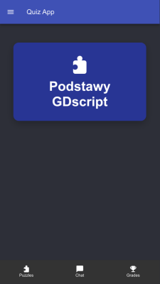
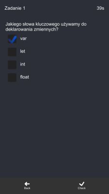

# Quiz App

Projek Quiz app (Alpha)
Aplikacja używa React jako front-end oraz node.js jako back-end.
Repozytorium back-end-u można znależć [Tutaj](https://github.com/kifner-mateusz/quiz-backend)

Aktualnu stan prac:

| Funkcja                | Stan         |
| ---------------------- | ------------ |
| Logowanie JWT          | zakonczone   |
| Rejestracja            | planowane    |
| Wybór Quizu            | zakończone   |
| Rozpoczęcie gry        | zakończone   |
| Sprawdzanie odpowiedzi | zakończone   |
| Zapis wyników          | planowane    |
| Opcje                  | trwają prace |
| Themes                 | planowane    |

