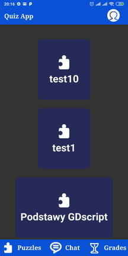
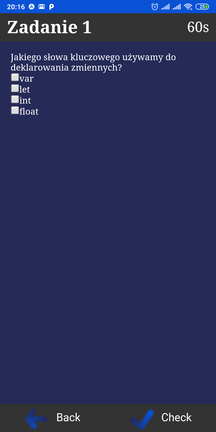

# Quiz App

Projek Quiz app (Alpha)
Aplikacja używa React jako front-end oraz node.js jako back-end.
Repozytorium back-end-u można znależć [Tutaj](https://github.com/kifner-mateusz/quiz-backend)

Aktualnu stan prac:

Funkcja | Stan
--- | ---
Logowanie JWT | zakonczone
Rejestracja | planowane
Wybór Quizu | zakończone
Rozpoczęcie gry | trwają prace
Sprawdzanie odpowiedzi | trwają prace
Zapis wyników | planowane
Opcje | trwają prace

